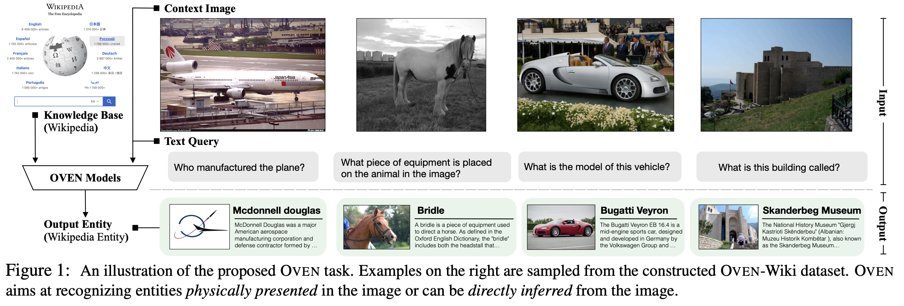

# Unofficial Data Downloading and Processing Pipeline for [OVEN](https://arxiv.org/abs/2302.11154)

[[Project Page]](https://open-vision-language.github.io/oven/)[[Paper]](https://arxiv.org/abs/2302.11154)
[[Dataset]](#oven-dataset)[[Sibling Project (Infoseek)]](https://open-vision-language.github.io/infoseek/)

<p align="center">
     <br>
    OVEN models recognize the Visual Entity on the Wikipedia, from images in the wild
</p>

**Open-domain Visual Entity Recognition: Towards Recognizing Millions of Wikipedia Entities**

[Hexiang Hu](https://www.hexianghu.com/), [Yi Luan](https://luanyi.github.io/), [Yang Chen](https://edchengg.github.io/), [Urvashi Khandelwal](https://urvashik.github.io/), [Mandar Joshi](https://mandarjoshi90.github.io/), [Kenton Lee](https://kentonl.com/), [Kristina Toutanova](http://kristinatoutanova.com/), [Ming-Wei Chang](https://mingweichang.org/).

## Release
- [6/7] Releasing the annotation for the [OVEN Dataset](#oven-dataset).
- [6/10] Implementing the data downloading script that can reproduce the data from original images. 

## OVEN Dataset

To download annotations and an image snapshot, please fill in this [form](https://forms.gle/SbWLfbexhQV9w2H26) and the link will be automatically shared with the registered email.

- Note: "oven_images" folder contains all images for OVEN and [InfoSeek](https://open-vision-language.github.io/infoseek/). "infoseek_images" folder is a subset of "oven_images".

To download all images from the source dataset, please go to "image_downloads/" and run all download scripts. Then run the following script to merge all data with [ovenid2impath.csv](https://drive.google.com/file/d/15ICSQfyF-lwpqYjkXZ3DryY4FVimQW0b/view?usp=drive_link):
```python
python merge_oven_images.py
```

## Evaluation
```python
python run_oven_eval.py

# ===== BLIP2 Zeroshot ====
# ===== Validation ========
# ===== Final score 7.87
# ===== Query Split score 20.58
# ===== Entity Split score 4.87
# ===== Query Seen Accuracy 24.63
# ===== Query Unseen Accuracy 17.68
# ===== Entity Seen Accuracy 8.55
# ===== Entity Unseen Accuracy 3.4
```

## Starting Code
- Run BLIP2 zero-shot inference:
```python
python run_blip2_oven.py --split val_entity
```
- Next, we need to run BM25 to map the BLIP2 predictions to Wikipedia 6M label space:
```python
python run_bm25_query.py --input_file {INPUT} --output_file {OUTPUT}
```
- Before running BM25, you need to run BM25 index of Wikiepdia (Download Wikipedia from the "Wiki6M_ver_1_0_title_only.jsonl")
```python
python run_bm25_index.py
```

## Acknowledgement
If you find OVEN useful for your your research and applications, please cite using this BibTeX:
```
@article{hu2023open,
  title={Open-domain Visual Entity Recognition: Towards Recognizing Millions of Wikipedia Entities},
  author={Hu, Hexiang and Luan, Yi and Chen, Yang and Khandelwal, Urvashi and Joshi, Mandar and Lee, Kenton and Toutanova, Kristina and Chang, Ming-Wei},
  journal={arXiv preprint arXiv:2302.11154},
  year={2023}
}
```
